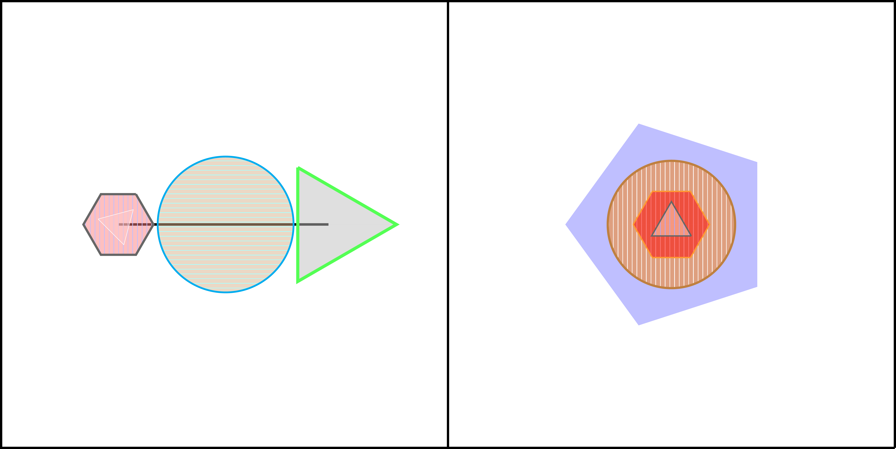

# Input Format Documentation

## Overview

This document describes the input format for the Geometric Image Generation system. The input consists of hierarchical JSON configuration files that define how geometric shapes and layouts are generated.

## File Structure

The input system follows a hierarchical file structure with reference-based composition. Here is an example:

```
input/
├── base.json                              # Main configuration file
├── basic_attributes_distribution.json     # Global attribute distributions
└── panel1/                               # Panel-specific configurations
    ├── element1.json                     # Element configuration
    ├── element2.json                     # Element configuration  
    ├── element3.json                     # Element configuration
    └── element1/                         # Nested element configurations for element1
        └── element1.json                 # Next level element config
```

## Configuration Hierarchy

### 1. Base Configuration (`base.json`)

The main configuration file that defines the overall structure and global settings.

**Required Fields:**

- `layout`: Array of two integers `[rows, cols]` defining the panel grid layout
- `canvas_width`: Float value for canvas width (default: 20.0)
- `canvas_height`: Float value for canvas height (default: 20.0)
- `opacity`: Float value between 0 and 1 for shape fill opacity
- `panel_configs`: Array of panel configuration objects

**Example:**
```json
{
    "layout": [1, 1],
    "canvas_width": 20.0,
    "canvas_height": 20.0,
    "opacity": 0.5,
    "panel_configs": [
        {
            "panel_id": 1,
            "composition_type": {
                "chaining": 1.0
            },
            "chaining_image_config": {
                "element_num": 3,
                "chain_shape": "line",
                "draw_chain": true,
                "chain_level": "bottom",
                "interval": 0.4,
                "rotation": 0,
                "sub_elements": [
                    {
                        "$ref": "./panel1/element1.json"
                    }
                ]
            }
        }
    ]
}
```

### 2. Global Attributes Distribution (`basic_attributes_distribution.json`)

Defines probability distributions for various visual attributes that apply globally unless overridden.

**Available Distributions:**

#### Color Distribution (`color_distribution`)
Array of 11 floats representing probabilities for each color:
- Index 0: white
- Index 1: black
- Index 2: red
- Index 3: green
- Index 4: blue
- Index 5: cyan
- Index 6: magenta
- Index 7: yellow
- Index 8: purple
- Index 9: brown
- Index 10: orange

#### Lightness Distribution (`lightness_distribution`)
Array of 10 floats for lightness levels:
- Index 0: lightness20
- Index 1: lightness25
- Index 2: lightness33
- Index 3: lightness40
- Index 4: lightness50
- Index 5: lightness60
- Index 6: lightness67
- Index 7: lightness75
- Index 8: lightness80
- Index 9: lightness100

#### Background Lightness Distribution (`background_lightness_distribution`)
Same structure as lightness distribution, but specifically for background elements.

#### Pattern Distribution (`pattern_distribution`)
Array of 13 floats for fill patterns:
- Index 0: blank
- Index 1: horizontal lines
- Index 2: vertical lines
- Index 3: northeast lines
- Index 4: northwest lines
- Index 5: grid
- Index 6: crosshatch
- Index 7: dots
- Index 8: crosshatch dots
- Index 9: five pointed stars
- Index 10: six pointed stars
- Index 11: bricks
- Index 12: checkerboard

#### Pattern Color Distribution (`pattern_color_distribution`)
Array of 11 floats representing probabilities for pattern colors:
- Index 0: pattern white
- Index 1: pattern black
- Index 2: pattern red
- Index 3: pattern green
- Index 4: pattern blue
- Index 5: pattern cyan
- Index 6: pattern magenta
- Index 7: pattern yellow
- Index 8: pattern purple
- Index 9: pattern brown
- Index 10: pattern orange

#### Pattern Lightness Distribution (`pattern_lightness_distribution`)
Array of 10 floats for pattern lightness levels:
- Index 0: pattern lightness 20
- Index 1: pattern lightness 25
- Index 2: pattern lightness 33
- Index 3: pattern lightness 40
- Index 4: pattern lightness 50
- Index 5: pattern lightness 60
- Index 6: pattern lightness 67
- Index 7: pattern lightness 75
- Index 8: pattern lightness 80
- Index 9: pattern lightness 100

#### Outline Distribution (`outline_distribution`)
Array of 12 floats for outline styles:
- Index 0: solid
- Index 1: dotted
- Index 2: densely dotted
- Index 3: loosely dotted
- Index 4: dashed
- Index 5: densely dashed
- Index 6: loosely dashed
- Index 7: dash dot
- Index 8: densely dash dot
- Index 9: dash dot dot
- Index 10: densely dash dot dot
- Index 11: loosely dash dot dot

#### Outline Color Distribution (`outline_color_distribution`)
Array of 11 floats representing probabilities for outline colors:
- Index 0: outline white
- Index 1: outline black
- Index 2: outline red
- Index 3: outline green
- Index 4: outline blue
- Index 5: outline cyan
- Index 6: outline magenta
- Index 7: outline yellow
- Index 8: outline purple
- Index 9: outline brown
- Index 10: outline orange

#### Outline Lightness Distribution (`outline_lightness_distribution`)
Array of 10 floats for outline lightness levels:
- Index 0: outline lightness 20
- Index 1: outline lightness 25
- Index 2: outline lightness 33
- Index 3: outline lightness 40
- Index 4: outline lightness 50
- Index 5: outline lightness 60
- Index 6: outline lightness 67
- Index 7: outline lightness 75
- Index 8: outline lightness 80
- Index 9: outline lightness 100

#### Outline Thickness Distribution (`outline_thickness_distribution`)
Array of 8 floats for outline thickness levels:
- Index 0: no outline
- Index 1: ultra thin
- Index 2: very thin
- Index 3: thin
- Index 4: semi thick
- Index 5: thick
- Index 6: very thick
- Index 7: ultra thick

#### Shape Distribution (`shape_distribution`)
Array of 9 floats for shape types:
- Index 0: line segment
- Index 1: circle
- Index 2: triangle
- Index 3: square
- Index 4: pentagon
- Index 5: hexagon
- Index 6: rectangle
- Index 7: right triangle
- Index 8: arbitrary closed shape

**Example:**
```json
{
    "color_distribution": [0.0, 0.25, 0.1, 0.1, 0.1, 0.1, 0.1, 0.1, 0.05, 0.05, 0.05],
    "pattern_color_distribution": [0.1, 0.3, 0.1, 0.1, 0.1, 0.05, 0.05, 0.05, 0.05, 0.05, 0.05],
    "pattern_lightness_distribution": [0.15, 0.15, 0.15, 0.15, 0.15, 0.1, 0.05, 0.05, 0.025, 0.025],
    "outline_color_distribution": [0.05, 0.4, 0.1, 0.1, 0.1, 0.05, 0.05, 0.05, 0.05, 0.025, 0.025],
    "outline_lightness_distribution": [0.2, 0.2, 0.15, 0.15, 0.1, 0.08, 0.05, 0.04, 0.02, 0.01],
    "outline_thickness_distribution": [0.2, 0.05, 0.1, 0.3, 0.2, 0.1, 0.04, 0.01],
    "shape_distribution": [0.0, 0.5, 0.5, 0.0, 0.0, 0.0, 0.0, 0.0, 0.0]
}
```

### 3. Panel and Element Configurations

Panel and element configurations share the same structure but at different hierarchy levels.

**Common Fields:**

#### Composition Type (`composition_type`)
Defines the generation strategy as a probability distribution:
```json
{
    "composition_type": {
        "simple": 0.3,
        "chaining": 0.4,
        "enclosing": 0.3
    }
}
```

**Available composition types:**
- `simple`: Single shape generation
- `chaining`: Chain-based arrangement
- `enclosing`: Nested/surrounding arrangements
- `border`: Border and corner placement
- `random`: Random distribution
- `radial`: Radial arrangement around center
- `parallel`: Parallel arrangement

#### Generator-Specific Configurations

Each composition type can have its own configuration object:

##### Simple Image Config (`simple_image_config`)
For single shape generation:
```json
{
    "simple_image_config": {
        "aspect_ratio": {
            "min": 0.5,
            "max": 2.0
        }
    }
}
```

##### Chaining Image Config (`chaining_image_config`)
For chain-based arrangements:
```json
{
    "chaining_image_config": {
        "element_num": 3,
        "chain_shape": "line",      // "line", "bezier", "circle"
        "draw_chain": true,
        "chain_level": "bottom",    // "bottom", "top"
        "interval": 0.4,
        "rotation": 0,
        "control_point_distribution": {  // Only used when chain_shape is "bezier"
            "x_range": [-0.125, 0.125],
            "y_range": [-0.5, 0.5],
            "pivot_points": [-0.75, -0.25, 0.25, 0.75]
        },
        "sub_elements": [...]
    }
}
```

**Fields:**
- `element_num`: Number of elements to arrange in the chain
- `chain_shape`: Shape of the chain path - "line", "bezier", or "circle"
- `draw_chain`: Whether to draw the chain path itself
- `chain_level`: Z-order of the chain relative to elements - "bottom" or "top"
- `interval`: Spacing between elements along the chain
- `rotation`: Rotation angle of the entire chain arrangement
- `control_point_distribution`: (Optional) Used only when `chain_shape` is "bezier" to control the Bézier curve shape
  - `x_range`: Array of two floats defining the horizontal range for control point offsets
  - `y_range`: Array of two floats defining the vertical range for control point offsets  
  - `pivot_points`: Array of floats defining normalized positions along the curve where control points are placed
- `sub_elements`: Array of child element configurations

##### Enclosing Image Config (`enclosing_image_config`)
For nested arrangements:
```json
{
    "enclosing_image_config": {
        "enclose_level": 2,
        "sub_elements": [...]
    }
}
```

##### Border Image Config (`border_image_config`)
For border placement:
```json
{
    "border_image_config": {
        "position_probabilities": [0.5, 0.5, 0.5, 0.5, 0.5, 0.5, 0.5, 0.5, 1.0],
        "element_scaling": 0.2,
        "approach_factor": 1.0,
        "shade_probability": 0.7,
        "sub_elements":[...]
    }
}
```

##### Random Image Config (`random_image_config`)
For random distribution:
```json
{
    "random_image_config": {
        "centralization": 0.5,
        "element_num": 5
    }
}
```

Each of these configuration objects (excluding `simple_image_config`) can carry an attribute `sub_elements`, which is an array of child elements' configurations (can be included as json file references, see explanation below). The exact meaning of each index is dependent on the composition type.

## Reference System

The configuration system supports JSON references using `$ref` to create modular, reusable configurations:

```json
{
    "sub_elements": [
        {
            "$ref": "./panel1/element1.json"
        },
        {
            "$ref": "./panel1/element2.json"
        }
    ]
}
```

**Reference Resolution:**
- Relative paths are resolved from the current file's location
- References can point to files at any level in the hierarchy, but it's suggested to keep the file / path naming convention: sub parts of a particular element or panel are to be kept in a folder, with same name and level of the element / panel.
- Circular references should be avoided

## Configuration Inheritance

The attributes in the system follows a hierarchical inheritance model:

1. **Global Distributions**: Defined in `basic_attributes_distribution.json`. It is same level as item 2 **Base Configuration**, and will be merged together during runtime.
2. **Base Configuration**: Global settings in `base.json`
3. **Panel Configuration**: Panel-specific overrides
4. **Element Configuration**: Element-specific overrides
5. **More Nested Element Configuration**: Deeper level overrides, if exist

Lower levels can override higher level settings. If a distribution or setting is not defined at a lower level, it inherits from the parent level.

## Validation Rules

1. **Probability Arrays**: All distribution arrays must sum to 1.0 or be normalized automatically
2. **Required Fields**: Each level must specify a `composition_type`
3. **Generator Consistency**: If a composition type is specified, its corresponding config object should be present
4. **Reference Validity**: All `$ref` paths must point to valid, accessible files
5. **Numerical Ranges**: Values like `opacity`, `interval`, `rotation` must be within valid ranges

## Example Complete Configuration

Here's a minimal but complete configuration example:

**base.json:**
```json
{
    "layout": [1, 1],
    "canvas_width": 20.0,
    "canvas_height": 20.0,
    "opacity": 0.5,
    "panel_configs": [
        {
            "composition_type": {"simple": 1.0},
            "simple_image_config": {}
        }
    ]
}
```

This creates a single panel with one simple shape using global attribute distributions.

## Best Practices

1. **Modular Design**: Use separate files for different elements to promote reusability
2. **Clear Hierarchy**: Organize configurations logically with intuitive file names
3. **Balanced Distributions**: Ensure probability distributions reflect desired output characteristics
4. **Documentation**: Include comments or maintain separate documentation for complex configurations
5. **Validation**: Test configurations with small generation runs before large-scale generation


## Examples

1. Input:  [input1.zip](input1.zip) 

   Output: 

2. Input:

   ```JSON
   {
       "layout": [
           2,
           2
       ],
       "canvas_width": 40.0,
       "canvas_height": 40.0,
       "opacity": 0.5,
       "panel_configs": [
           {
               "panel_id": 1,
               "composition_type": {
                   "chaining": 1.0
               },
               "chaining_image_config": {
                   "element_num": 3,
                   "chain_shape": "line",
                   "draw_chain": true,
                   "chain_level": "bottom",
                   "interval": 0.4,
                   "rotation": 0,
                   "sub_elements": [
                       {
                           "id": 1,
                           "composition_type": {
                               "enclosing": 1.0
                           },
                           "enclosing_image_config": {
                               "enclose_level": 2,
                               "sub_elements": [
                                   {
                                       "composition_type": {
                                           "simple": 1.0
                                       },
                                       "simple_image_config": {},
                                       "shape_distribution": [
                                           0.0,
                                           0.5,
                                           0.5,
                                           0.0,
                                           0.0,
                                           0.0,
                                           0.0,
                                           0.0,
                                           0.0
                                       ]
                                   }
                               ]
                           }
                       },
                       {
                           "composition_type": {
                               "simple": 1.0
                           },
                           "simple_image_config": {}
                       },
                       {
                           "composition_type": {
                               "simple": 1.0
                           },
                           "simple_image_config": {}
                       }
                   ]
               }
           },
           {
               "panel_id": 2,
               "composition_type": {
                   "enclosing": 1.0
               },
               "enclosing_image_config": {
                   "enclose_level": 3,
                   "sub_elements": [
                       {
                           "id": 2,
                           "composition_type": {
                               "enclosing": 1.0
                           },
                           "enclosing_image_config": {
                               "enclose_level": 2,
                               "sub_elements": [
                                   {
                                       "id": 3,
                                       "composition_type": {
                                           "simple": 1.0
                                       },
                                       "simple_image_config": {}
                                   }
                               ]
                           }
                       }
                   ]
               }
           },
           {
               "panel_id": 3,
               "composition_type": {
                   "enclosing": 1.0
               },
               "enclosing_image_config": {
                   "enclose_level": 3,
                   "sub_elements": [
                       {
                           "id": 2,
                           "composition_type": {
                               "enclosing": 1.0
                           },
                           "enclosing_image_config": {
                               "enclose_level": 2,
                               "sub_elements": [
                                   {
                                       "id": 3,
                                       "composition_type": {
                                           "simple": 1.0
                                       },
                                       "simple_image_config": {}
                                   }
                               ]
                           }
                       }
                   ]
               }
           },
           {
               "panel_id": 4,
               "composition_type": {
                   "enclosing": 1.0
               },
               "enclosing_image_config": {
                   "enclose_level": 3,
                   "sub_elements": [
                       {
                           "id": 2,
                           "composition_type": {
                               "enclosing": 1.0
                           },
                           "enclosing_image_config": {
                               "enclose_level": 2,
                               "sub_elements": [
                                   {
                                       "id": 3,
                                       "composition_type": {
                                           "simple": 1.0
                                       },
                                       "simple_image_config": {}
                                   }
                               ]
                           }
                       }
                   ]
               }
           }
       ],
       "color_distribution": [
           0.0,
           0.25,
           0.1,
           0.1,
           0.1,
           0.1,
           0.1,
           0.1,
           0.05,
           0.05,
           0.05
       ],
       "lightness_distribution": [
           0.0,
           0.2,
           0.2,
           0.1,
           0.1,
           0.1,
           0.02,
           0.02,
           0.02,
           0.02,
           0.22
       ],
       "background_lightness_distribution": [
           1.0,
           0.0,
           0.0,
           0.0,
           0.0,
           0.0,
           0.0,
           0.0,
           0.0,
           0.0,
           0.0
       ],
       "pattern_distribution": [
           0.4,
           0.3,
           0.3,
           0.0,
           0.0,
           0.0,
           0.0,
           0.0,
           0.0,
           0.0,
           0.0,
           0.0,
           0.0
       ],
       "pattern_color_distribution": [
           0.1,
           0.3,
           0.1,
           0.1,
           0.1,
           0.05,
           0.05,
           0.05,
           0.05,
           0.05,
           0.05
       ],
       "pattern_lightness_distribution": [
           0.15,
           0.15,
           0.15,
           0.15,
           0.15,
           0.1,
           0.05,
           0.05,
           0.025,
           0.025
       ],
       "outline_distribution": [
           1.0,
           0.0,
           0.0,
           0.0,
           0.0,
           0.0,
           0.0,
           0.0,
           0.0,
           0.0,
           0.0,
           0.0
       ],
       "outline_color_distribution": [
           0.05,
           0.4,
           0.1,
           0.1,
           0.1,
           0.05,
           0.05,
           0.05,
           0.05,
           0.025,
           0.025
       ],
       "outline_lightness_distribution": [
           0.2,
           0.2,
           0.15,
           0.15,
           0.1,
           0.08,
           0.05,
           0.04,
           0.02,
           0.01
       ],
       "outline_thickness_distribution": [
           0.2,
           0.05,
           0.1,
           0.3,
           0.2,
           0.1,
           0.04,
           0.01
       ],
       "shape_distribution": [
           0.0,
           0.5,
           0.5,
           0.0,
           0.0,
           0.0,
           0.0,
           0.0,
           0.0
       ]
   }
   ```

   

​	Output:

​	


3. Input:

   ```
   {
       "layout": [
           1,
           1
       ],
       "canvas_width": 20.0,
       "canvas_height": 20.0,
       "opacity": 0.5,
       "panel_configs": [
           {
               "panel_id": 1,
               "composition_type": {
                   "chaining": 1.0
               },
               "chaining_image_config": {
                   "element_num": 5,
                   "chain_shape": "bezier",
                   "draw_chain": true,
                   "chain_level": "bottom",
                   "interval": 0.4,
                   "rotation": 0,
                   "control_point_distribution": {
                       "x_range": [
                           -0.125,
                           0.125
                       ],
                       "y_range": [
                           -0.5,
                           0.5
                       ],
                       "pivot_points": [
                           -0.75,
                           -0.25,
                           0.25,
                           0.75
                       ]
                   },
                   "sub_elements": [
                       {
                           "id": 1,
                           "composition_type": {
                               "enclosing": 1.0
                           },
                           "enclosing_image_config": {
                               "enclose_level": 2,
                               "sub_elements": [
                                   {
                                       "composition_type": {
                                           "simple": 1.0
                                       },
                                       "simple_image_config": {},
                                       "shape_distribution": [
                                           0.0,
                                           0.5,
                                           0.5,
                                           0.0,
                                           0.0,
                                           0.0,
                                           0.0,
                                           0.0,
                                           0.0
                                       ]
                                   }
                               ]
                           }
                       },
                       {
                           "composition_type": {
                               "simple": 1.0
                           },
                           "simple_image_config": {}
                       },
                       {
                           "composition_type": {
                               "simple": 1.0
                           },
                           "simple_image_config": {}
                       },
                       {
                           "composition_type": {
                               "simple": 1.0
                           },
                           "simple_image_config": {}
                       },
                       {
                           "composition_type": {
                               "simple": 1.0
                           },
                           "simple_image_config": {}
                       }
                   ]
               }
           }
       ],
       "color_distribution": [
           0.0,
           0.25,
           0.1,
           0.1,
           0.1,
           0.1,
           0.1,
           0.1,
           0.05,
           0.05,
           0.05
       ],
       "lightness_distribution": [
           0.0,
           0.2,
           0.2,
           0.1,
           0.1,
           0.1,
           0.02,
           0.02,
           0.02,
           0.02,
           0.22
       ],
       "background_lightness_distribution": [
           1.0,
           0.0,
           0.0,
           0.0,
           0.0,
           0.0,
           0.0,
           0.0,
           0.0,
           0.0,
           0.0
       ],
       "pattern_distribution": [
           0.4,
           0.3,
           0.3,
           0.0,
           0.0,
           0.0,
           0.0,
           0.0,
           0.0,
           0.0,
           0.0,
           0.0,
           0.0
       ],
       "pattern_color_distribution": [
           0.1,
           0.3,
           0.1,
           0.1,
           0.1,
           0.05,
           0.05,
           0.05,
           0.05,
           0.05,
           0.05
       ],
       "pattern_lightness_distribution": [
           0.15,
           0.15,
           0.15,
           0.15,
           0.15,
           0.1,
           0.05,
           0.05,
           0.025,
           0.025
       ],
       "outline_distribution": [
           1.0,
           0.0,
           0.0,
           0.0,
           0.0,
           0.0,
           0.0,
           0.0,
           0.0,
           0.0,
           0.0,
           0.0
       ],
       "outline_color_distribution": [
           0.05,
           0.4,
           0.1,
           0.1,
           0.1,
           0.05,
           0.05,
           0.05,
           0.05,
           0.025,
           0.025
       ],
       "outline_lightness_distribution": [
           0.2,
           0.2,
           0.15,
           0.15,
           0.1,
           0.08,
           0.05,
           0.04,
           0.02,
           0.01
       ],
       "outline_thickness_distribution": [
           0.2,
           0.05,
           0.1,
           0.3,
           0.2,
           0.1,
           0.04,
           0.01
       ],
       "shape_distribution": [
           0.0,
           0.5,
           0.5,
           0.0,
           0.0,
           0.0,
           0.0,
           0.0,
           0.0
       ]
   }
   ```

   Output:

   

4. Input:

   ```
   {
       "layout": [
           1,
           1
       ],
       "canvas_width": 20.0,
       "canvas_height": 20.0,
       "opacity": 0.5,
       "panel_configs": [
           {
               "panel_id": 1,
               "composition_type": {
                   "random": 1.0
               },
               "random_image_config": {
                   "element_num": 5,
                   "centralization": 0.5,
                   "sub_elements": [
                       {
                           "id": 1,
                           "composition_type": {
                               "enclosing": 1.0
                           },
                           "enclosing_image_config": {
                               "enclose_level": 2,
                               "sub_elements": [
                                   {
                                       "composition_type": {
                                           "simple": 1.0
                                       },
                                       "simple_image_config": {},
                                       "shape_distribution": [
                                           0.0,
                                           0.5,
                                           0.5,
                                           0.0,
                                           0.0,
                                           0.0,
                                           0.0,
                                           0.0,
                                           0.0
                                       ]
                                   }
                               ]
                           }
                       },
                       {
                           "composition_type": {
                               "simple": 1.0
                           },
                           "simple_image_config": {}
                       },
                       {
                           "composition_type": {
                               "simple": 1.0
                           },
                           "simple_image_config": {}
                       },
                       {
                           "composition_type": {
                               "simple": 1.0
                           },
                           "simple_image_config": {}
                       },
                       {
                           "composition_type": {
                               "simple": 1.0
                           },
                           "simple_image_config": {}
                       }
                   ]
               }
           }
       ],
       "color_distribution": [
           0.0,
           0.25,
           0.1,
           0.1,
           0.1,
           0.1,
           0.1,
           0.1,
           0.05,
           0.05,
           0.05
       ],
       "lightness_distribution": [
           0.0,
           0.2,
           0.2,
           0.1,
           0.1,
           0.1,
           0.02,
           0.02,
           0.02,
           0.02,
           0.22
       ],
       "background_lightness_distribution": [
           1.0,
           0.0,
           0.0,
           0.0,
           0.0,
           0.0,
           0.0,
           0.0,
           0.0,
           0.0,
           0.0
       ],
       "pattern_distribution": [
           0.4,
           0.3,
           0.3,
           0.0,
           0.0,
           0.0,
           0.0,
           0.0,
           0.0,
           0.0,
           0.0,
           0.0,
           0.0
       ],
       "pattern_color_distribution": [
           0.1,
           0.3,
           0.1,
           0.1,
           0.1,
           0.05,
           0.05,
           0.05,
           0.05,
           0.05,
           0.05
       ],
       "pattern_lightness_distribution": [
           0.15,
           0.15,
           0.15,
           0.15,
           0.15,
           0.1,
           0.05,
           0.05,
           0.025,
           0.025
       ],
       "outline_distribution": [
           1.0,
           0.0,
           0.0,
           0.0,
           0.0,
           0.0,
           0.0,
           0.0,
           0.0,
           0.0,
           0.0,
           0.0
       ],
       "outline_color_distribution": [
           0.05,
           0.4,
           0.1,
           0.1,
           0.1,
           0.05,
           0.05,
           0.05,
           0.05,
           0.025,
           0.025
       ],
       "outline_lightness_distribution": [
           0.2,
           0.2,
           0.15,
           0.15,
           0.1,
           0.08,
           0.05,
           0.04,
           0.02,
           0.01
       ],
       "outline_thickness_distribution": [
           0.2,
           0.05,
           0.1,
           0.3,
           0.2,
           0.1,
           0.04,
           0.01
       ],
       "shape_distribution": [
           0.0,
           0.5,
           0.5,
           0.0,
           0.0,
           0.0,
           0.0,
           0.0,
           0.0
       ]
   }
   ```

Output:

​	

5. Input:

   ```json
   {
       "layout": [
           1,
           1
       ],
       "canvas_width": 20.0,
       "canvas_height": 20.0,
       "opacity": 0.5,
       "panel_configs": [
           {
               "panel_id": 1,
               "composition_type": {
                   "enclosing": 1.0
               },
               "enclosing_image_config": {
                   "enclose_level": 2,
                   "sub_elements": [
                       {
                           "id": 1,
                           "composition_type": {
                               "chaining": 1.0
                           },
                           "chaining_image_config": {
                               "element_num": 3,
                               "chain_shape": "bezier",
                               "draw_chain": true,
                               "chain_level": "bottom",
                               "interval": 0.4,
                               "rotation": 0,
                               "control_point_distribution": {
                                   "x_range": [
                                       -0.125,
                                       0.125
                                   ],
                                   "y_range": [
                                       -0.5,
                                       0.5
                                   ],
                                   "pivot_points": [
                                       -0.75,
                                       -0.25,
                                       0.25,
                                       0.75
                                   ]
                               },
                               "sub_elements": [
                                   {
                                       "composition_type": {
                                           "simple": 1.0
                                       },
                                       "simple_image_config": {},
                                       "shape_distribution": [
                                           0.0,
                                           0.5,
                                           0.5,
                                           0.0,
                                           0.0,
                                           0.0,
                                           0.0,
                                           0.0,
                                           0.0
                                       ]
                                   },
                                   {
                                       "composition_type": {
                                           "simple": 1.0
                                       },
                                       "simple_image_config": {}
                                   },
                                   {
                                       "composition_type": {
                                           "simple": 1.0
                                       },
                                       "simple_image_config": {}
                                   }
                               ]
                           }
                       }
                   ]
               }
           }
       ],
       "color_distribution": [
           0.0,
           0.25,
           0.1,
           0.1,
           0.1,
           0.1,
           0.1,
           0.1,
           0.05,
           0.05,
           0.05
       ],
       "lightness_distribution": [
           0.0,
           0.2,
           0.2,
           0.1,
           0.1,
           0.1,
           0.02,
           0.02,
           0.02,
           0.02,
           0.22
       ],
       "background_lightness_distribution": [
           1.0,
           0.0,
           0.0,
           0.0,
           0.0,
           0.0,
           0.0,
           0.0,
           0.0,
           0.0,
           0.0
       ],
       "pattern_distribution": [
           0.4,
           0.3,
           0.3,
           0.0,
           0.0,
           0.0,
           0.0,
           0.0,
           0.0,
           0.0,
           0.0,
           0.0,
           0.0
       ],
       "pattern_color_distribution": [
           0.1,
           0.3,
           0.1,
           0.1,
           0.1,
           0.05,
           0.05,
           0.05,
           0.05,
           0.05,
           0.05
       ],
       "pattern_lightness_distribution": [
           0.15,
           0.15,
           0.15,
           0.15,
           0.15,
           0.1,
           0.05,
           0.05,
           0.025,
           0.025
       ],
       "outline_distribution": [
           1.0,
           0.0,
           0.0,
           0.0,
           0.0,
           0.0,
           0.0,
           0.0,
           0.0,
           0.0,
           0.0,
           0.0
       ],
       "outline_color_distribution": [
           0.05,
           0.4,
           0.1,
           0.1,
           0.1,
           0.05,
           0.05,
           0.05,
           0.05,
           0.025,
           0.025
       ],
       "outline_lightness_distribution": [
           0.2,
           0.2,
           0.15,
           0.15,
           0.1,
           0.08,
           0.05,
           0.04,
           0.02,
           0.01
       ],
       "outline_thickness_distribution": [
           0.2,
           0.05,
           0.1,
           0.3,
           0.2,
           0.1,
           0.04,
           0.01
       ],
       "shape_distribution": [
           0.0,
           0.5,
           0.5,
           0.0,
           0.0,
           0.0,
           0.0,
           0.0,
           0.0
       ]
   }
   ```

Output:

​	
