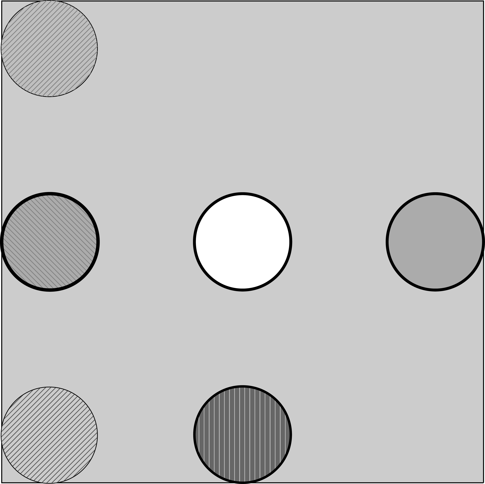

[](https://deepwiki.com/lingaoliu105/Geometric-Image-Generation)


### Input Format

User input shall be given in a json file (`/input.json`). Supported fields are:

1. `color_mode`, which represents the images should be colored or in black and white.
     Supported options are:
     1. `mono`: the images are black and white
     2. ` colored`: the images are colored

2. `canvas_width`: The width of the canvas. Default `20.0`

3. `canvas_height`: The height of the canvas. Default `20.0`

4. `layout`: The layout of the panels, given in the form of a 2-entry array.

      > Example:
      >
      > ```json
      > {
      > ...,
      > "layout":[2,2],
      > // The image will have 4 panels, 2 columns and 2 rows
      > }
      > ```
      >

5. `opacity`: the fill opacity of shapes, ranges from 0 to 1.

6. `generated_file_prefix`: the prefix of the generated files' names.

7. `composition_type`: how the individual elements on a single panel are composed.

   1. `chain`: the elements are organized in  a  chain
   2. `random`: the elements are randomly placed on the panel
   3. `radial`: several elements surrounding a central element
   4. `simple`: only one element is generated on the panel
   5. `enclosing`: will generate an enclosing image on panel

8. `sub_composition_distribution`: an json object of above options from `composition_type` as keys, and their frequencies (represented in floating numbers) as the values. This object will be used to choose how each element is generated under the rule of `composition_type`.

      > Example:
      >
      > ```json
      > {
      >     "composition_type": "random",
      >     "sub_composition_distribution":{"simple":0.5,"chain":0.5},
      >     // The top-level generation rule is random, while each sub-element have 0.5/	probability to be simple shapes or 0.5 probability to be chaining images
      > }
      > ```
      >

      *Edited:*

      `sub_composition_distribution` no longer be placed at outmost level. Instead, it should be placed in the config objects of each image generator setup, to customize for each generator and allow multi-level sub compositions

1. `color_distribution`: a list of floats of length 11, each number represents the probability of choosing the specific color as the filling color of the elements. The list of numbers should add up to 1. The mapping of each index and color is as follows:

      | Index | Color   |
      | ----- | ------- |
      | 0     | white   |
      | 1     | black   |
      | 2     | red     |
      | 3     | green   |
      | 4     | blue    |
      | 5     | cyan    |
      | 6     | magenta |
      | 7     | yellow  |
      | 8     | purple  |
      | 9     | brown   |
      | 10    | orange  |

      > Example:
      >
      > ```json
      > {
      > ...,
      > "color_distribution":[0.1, 0.1, 0.1, 0.1, 0.1, 0.1, 0.1, 0.1, 0.1, 0.1] 
      > // The colors are evenly distributed, each with 0.1 probability
      > }
      > 
      > ```

2. `lightness_distribution`: the probability distribution for filling color's lightness:

      | Index | Lightness    |
      | ----- | ------------ |
      | 0     | lightness20  |
      | 1     | lightness25  |
      | 2     | lightness33  |
      | 3     | lightness40  |
      | 4     | lightness50  |
      | 5     | lightness60  |
      | 6     | lightness67  |
      | 7     | lightness75  |
      | 8     | lightness80  |
      | 9     | lightness100 |

      

3. `pattern_distribution`: an array of floats representing the probabilities of filling patterns:

      | Index | Pattern            |
      | ----- | ------------------ |
      | 0     | blank              |
      | 1     | horizontal Lines   |
      | 2     | vertical Lines     |
      | 3     | north East Lines   |
      | 4     | north West Lines   |
      | 5     | grid               |
      | 6     | crosshatch         |
      | 7     | dots               |
      | 8     | crosshatch Dots    |
      | 9     | five pointed Stars |
      | 10    | six pointed Stars  |
      | 11    | bricks             |
      | 12    | checkerboard       |


​      

11. `chaining_image_config`: an individual json object. Only works when `composition_type` is `chain`, or `chain` is assigned as one of possible sub generators. The structure is as follows:

    | Field Name      | Accepted Values                     | Meaning                                                      |
    | --------------- | ----------------------------------- | ------------------------------------------------------------ |
    | `"draw_chain"`  | `True` or `False`                   | whether to draw or hide the chain (string)                   |
    | `"chain_level"` | `"bottom"` or `"top"`               | on which level should the chain be drawn (below or above shapes) |
    | `"chain_shape"` | `"line"`, `"bezier"` or `"circle"`  | the shape of the internal chain                              |
    | `"interval"`    | a float around 0                    | The interval between 2 adjacent elements. A positive interval means there's a distance, 0 interval means the shapes touches each other. Negative interval means overlap |
    | `"element_num"` | a positive integer                  | The number of elements on the chaining string                |
    | `"rotation"`    | a positive number between 0 and 180 | how big is the angle that the chain (axis) should rotate, starting from being aligned horizontally (0 degree) |

12. `random_image_config`: an individual json object. Only works when `composition_type` is `random`. or `random` is assigned as one of the possible sub generators. The structure is as follows:

    | Field Name         | Accepted Values         | Meaning                                                      |
    | ------------------ | ----------------------- | ------------------------------------------------------------ |
    | `"centralization"` | a float between 0 and 1 | a parameter that allows elements' position closer to the center to produce more overlaps. 0 means no tuning. 1 means all elements will be shifted to the center. |
    | `"element_num"`    | a positive integer      | The number of elements on the chaining string                |

13. `radial_image_config`: an individual json object. Only works when `composition_type` is `radial`, or `radial` is specified as one of sub generators. The structure is as follows:

    | Field Name | Accepted Values | Meaning |
    | ---------- | --------------- | ------- |
    | TBD        | TBD             | TBD     |

14. `enclosing_image_config`: an individual json object, specifying relevant configurations of enclosing shape patterns:
       | Field Name        | Accepted Values | Meaning                     |
       | ----------------- | --------------- | ----------------------------|
       | `"enclose_level"` | an integer >= 2 | How many levels of enclosure|

15. `border_image_config`: an individual json object, specifying relevant configurations of shapes being placed at border of canvas (i.e edge midpoints and corners):

    > Edit: border image generator now also takes charge of center positioning

    | Field Name                 | Accepted Values                                     | Meaning                                                      |
    | -------------------------- | --------------------------------------------------- | ------------------------------------------------------------ |
    | `"position_probabilities"` | an array of length 9,each number is between 0 and 1 | The probability for each position (specified below) to hold elements |
    | `"element_scaling"`        | float between 0 and 1                               | the ratio to scale the element on each entry. (starting from element occupying whole panel) |
    | `"approach_factor"`        | float between 0 and 1                               | how much should the elements be pushed to border (0 for staying at center and 1 for touching the border) (not applicable for line segments) |
    | `"shade_probability"`      | float between 0 and 1                               | the probability for the region formed between 2 line segments to be shaded |

    The `position_probabilities` is as specified below:

    | Index | Position <br />(assigned clockwise) |
    | ----- | ----------------------------------- |
    | 0     | middle-right                        |
    | 1     | top-right                           |
    | 2     | top-middle                          |
    | 3     | top-left                            |
    | 4     | middle-left                         |
    | 5     | bottom-left                         |
    | 6     | bottom-middle                       |
    | 7     | bottom-right                        |
    | 8     | center                              |

    > Example:
    >
    > ```json
    >     "border_image_config":{
    >         "position_probabilities":[
    >             0.5,
    >             0.5,
    >             0.5,
    >             0.5,
    >             0.5,
    >             0.5,
    >             0.5,
    >             0.5
    >         ] // each position have 0.5 probability to hold something (depending on sub generators)
    >     }
    > ```
    >
    > 

16. `shape_distribution`: an array that specifies the probability of shape occurrence. The details are as follows:

    | Index | Shape         |
    | ----- | ------------- |
    | 0     | line segment  |
    | 1     | circle        |
    | 2     | triangle      |
    | 3     | square        |
    | 4     | pentagon      |
    | 5     | hexagon       |
    | 6     | rectangle     |
    | 7     | triangle_rt   |
    | 8     | arbitrary     |

17. `simple_image_config`: an individual json object that controls the generation of simple shapes. The structure is as follows:

    | Field Name | Accepted Values | Meaning |
    | ---------- | --------------- | ------- |
    | `"seed"` | integer | The random seed for deterministic generation |
    | `"shape_size"` | object with "min" and "max" fields | The size range for generated shapes |
    | `"aspect_ratio"` | object with "min" and "max" fields | The aspect ratio range for rectangles and right triangles |
    | `"rotation_angles"` | array of integers | List of allowed rotation angles in degrees |
    | `"polygon_generation"` | object | Configuration for arbitrary polygon generation |

    Example:
    ```json
    {
        "simple_image_config": {
            "seed": 42,
            "shape_size": {"min": 1.0, "max": 5.0},
            "aspect_ratio": {"min": 0.5, "max": 2.0},
            "rotation_angles": [0, 45, 90, 135, 180],
            "polygon_generation": {
                "start_position": [0, 0],
                "cell_selection_order": "random"
            }
        }
    }
    ```
    | 3     | square                                          |
    | 4     | pentagon                                        |
    | 5     | hexagon                                         |
    | 6     | rectangle (aspect ratio range from 1 to 3)      |
    | 7     | right triangle (aspect ratio range from 1 to 3) |
    | 8     | arbitrary closed shape                          |
    
17. `arbitrary_shape_cell_num`: the number of cells (blocks) for generating arbitrary orthogonal shapes. The more cells will generate more complex shapes.


### Output Format

The generated images will be stored in `/my_dataset`, together with `label.json` which contains data annotations to the images, following COCO format.


### Expected Output Images and Corresponding Inputs

#### (age 7-8 page 5)

### 


Input: 

```json
{   
    "composition_type": "chain",
    "shape_distribution": [
        0.0,
        0.2,
        0.2,
        0.2,
        0.2,
        0.2,
        0.0,
        0.0,
        0.0
    ], // only keep desired shapes
    "border_image_config":{
        "position_probabilities":[
            0.0,
            0.0,
            0.0,
            0.0,
            0.0,
            0.0,
            0.0,
            1.0,
            0.0
        ], // adjust for the nested part to be single shape / multi shape, etc
        "element_scaling":0.5,
    },
    "chaining_image_config": {
        "draw_chain": false,
        "chain_shape": "line",
        "interval": 0.0,
        "element_num": 2,
        "sub_composition_distribution": {
            "simple": 0.3,
            "enclosing": 0.7
        }

    },
    "enclosing_image_config": {
        "enclose_level": 2,
        "sub_composition_distribution": {
            "border": 1.0
        }
    },
}
```

output:


#### (age 7-8,page 11)

Question:


Input:

```json
{
    "composition_type": "border",
    "shape_distribution": [
        0.0,
        0.4,
        0.0,
        0.0,
        0.0,
        0.0,
        0.3,0.3,0.0
    ],
    "border_image_config":{
        "position_probabilities":[
            0.0,
            0.5,
            0.0,
            0.5,
            0.0,
            0.5,
            0.0,
            0.5,
            1.0
        ],
        "element_scaling":0.2,
        "approach_factor":1.0,
    }
}
```

Output:


#### (age 7-8, page 11)

Question:


Input:

```json
{
    "composition_type": "chain",
    "shape_distribution": [
        0.0,
        1.0,
        0.0,
        0.0,
        0.0,
        0.0,
        0.0,0.0,0.0
    ],
        "chaining_image_config": {
        "draw_chain": true,
        "chain_level":"bottom",
        "chain_shape": "bezier",
        "interval": 0.4,
        "element_num": 6,
        "rotation": 90,
        "sub_composition_distribution": {
            "simple": 1.0
        }

    },
}
```

Output:


#### (age 7-8, page 13)

Question:


Input:

```json
{
    "composition_type": "chain",
    "shape_distribution": [
        0.0,
        0.7,
        0.0,
        0.3,
        0.0,
        0.0,
        0.0,0.0,0.0
    ],
        "chaining_image_config": {
        "draw_chain": false,
        "chain_level":"bottom",
        "chain_shape": "line",
        "interval": 0.4,
        "element_num": 10,
        "rotation": 90,
        "sub_composition_distribution": {
            "simple": 1.0
        }

    },
}
```

Output:


#### (age 7-8, page 17) Missing Shapes

Question:


Input:

```json
{
    "composition_type": "border",

    "shape_distribution": [
        0.6,
        0.2,
        0.0,
        0.2,
        0.0,
        0.0,
        0.0,0.0,0.0
    ],
    "border_image_config":{
        "position_probabilities":[
            0.0,
            0.7,
            0.0,
            0.7,
            0.0,
            0.7,
            0.0,
            0.7,
            0.0
        ],
        "element_scaling":0.25,
        "approach_factor":1.0,
        "shade_probability":0.7
    }
}
```

Output:


#### (age 7-8, page 17) Missing Shapes

Question:


Input:

```json
{
    "composition_type": "border",
    "shape_distribution": [
        0.0,
        1.0,
        0.0,
        0.0,
        0.0,
        0.0,
        0.0,
        0.0,
        0.0
    ],
    "border_image_config":{
        "position_probabilities":[
            0.5,
            0.5,
            0.5,
            0.5,
            0.5,
            0.5,
            0.5,
            0.5,
            0.5
        ], // alter the probabilities to get specific layout
        "element_scaling":0.2,
        "approach_factor":0.8,
        "shade_probability":0.7
    }
}
```

Output:




#### (age 7-8, page 19) Rotating Shapes

Question:


Input:

```json
{
    "composition_type": "simple",
    "shape_distribution": [
        0.0,
        0.0,
        0.0,
        0.0,
        0.0,
        0.0,
        0.0,
        0.0,
        1.0
    ],
}
```

Output:


#### (age 7-8, page 22) Mixed

Question:


Input

```json
{
    "composition_type": "border",
    "shape_distribution": [
        0.5,
        0.5,
        0.0,
        0.0,
        0.0,
        0.0,
        0.0,
        0.0,
        0.0
    ],
    "border_image_config":{
        "position_probabilities":[
            0.5,
            0.0,
            1.0,
            0.0,
            0.5,
            0.0,
            1.0,
            0.0,
            0.0
        ],
        "element_scaling":0.2,
        "approach_factor":1.0,
        "shade_probability":0.7
    }
}
```

Output:


